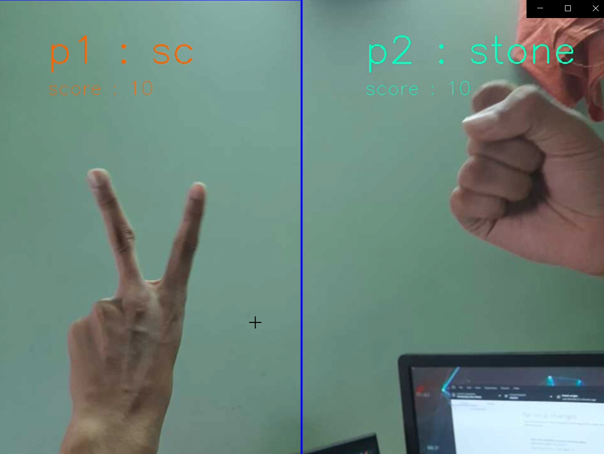

# Rock_paper_Scissors_Game
This Game is for two players. 

## Data:
I used the data from kaggle on rock-paper-scissors game(https://www.kaggle.com/drgfreeman/rockpaperscissors) and I also used the images provided by tensorflow. Since these images were not diverse in back ground color so I created my own dataset of images in addition. You can create yor own dataset by using Collect_images.ipynb notebook 

## Methodology:
I used tensorflow Image data generator for more distorted images and used them from directly by using flow from directory method. For trainig I used mobilenet v2 as base model because it performed better than efficient nets and other conv nets for this task, but you can use any model you want. The weights and the architecture of model are saved in saver folder for its use in real time. 

## View the Game:
The notebook View_the_game.ipynb is for real time game view, prediction, and declearation of winner. You can use any camera for this purpose I used  my mobile camera for this by using its IP address in similar way you can use your device camera just by specifing the IP address and start streaming. The screen will be splited in two parts for player 1 and player 2. A batch of images will we used to make a prediction this also gives some milliseconds time to players to get ready for their next turn or the next round. According to the max points for winning, one change the time for streaming, That will be specified in the notebook.

## Here is a Quick Demo of this project

